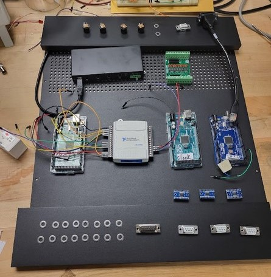

This repository contains KiCAD drawings for the LED driver PCB design, LED driver box connections, and DIO box connections. It also has the SolidWorks drawings for the panel cutouts in those boxes for CNC machining.

## LED driver
This PCB design is for driving the LED rings at 100FPS with 1A current. Each board will be able to drive 20 IR LEDs (LZ1-00R402-0000) in series. The wiring into the PCB is connectorized, so if a board fails, it can be fixed by plugging into the backup board. The op-amp is also installed onto a DIP8 daughter board, so switching a burned-out op-amp does not require soldering in the box. 

## LED driver box
Three PCB boards drive one LED ring, consisted of 57 LEDs total (19 in each segment). There are three sets of boards in the box, corresponding to three LED rings, plus one backup board. Three 48V 3A power supplies each power one LED ring (three boards). Clock signals from the DIO box and the control voltage pins from the PLC go through DB15 and DB9 connectors, respectively. All digital grounds are connected together, but not necessarily shared with the chassis ground (because of the painted panels). Each LED segment is connected in series with a 1 Ohm power resistor that can be used to sense the current, and also protects the LEDs inside the chamber. On the back, each LED uses a 6-pin amphenol connector, one power and one return pins for each of the LED segments. 

## Digital I/O box
The DIO box is the central hub for all logic signals, including triggers, clocks, and camera controls. The back panel has four power supply jacks, each rated for 5V 3A. Three are passed through DB9s on the front panel to power the RPis for cameras, and one is used to power the USB hub. A USB jack on the back is connected to the hub, which in turn powers the three Arduinos and one NI USB device. One Arduino is responsible for trigger fan-in/fan-out. It takes trigger in and out from the 16 lemo connectors and the three camera DB9s on the front, as well as through the PLC DB9 on the back, and from the NI device from run control. The trigger reset signal comes from the NI device as well. THe clock Arduino sends clock out through the camera clock DB9 on the back, and also LED DB15 on the front. Another Ethernet jack is plugged into the ethernet shield on the Arduino for bellow position sensing. Two lemo connectors with isolated grounds are used for the sensing line for the position sensor, while the pulse signals are sent through the PLC DB9. Inside the box all digital grounds are connected together, and logic level converter or voltage divider is used for converting voltage between 3.3V(RPi), 5V (NI,Arduino,etc), and 24V (PLC). 

